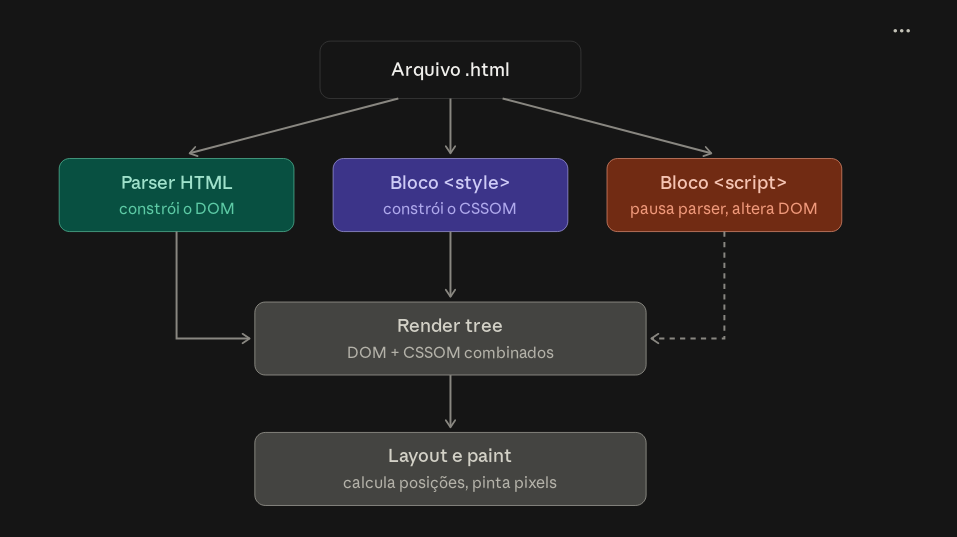

# AMBIENTE WEB

O browser faz uma requisição http pro servidor (back).
O browser é o runtime.
O browser pode ler um arquivo através de file:// 
  Nesse caso, nem há servidor entregando o arquivo.
  Um gh pages como servidor estático, só entrega o html.
O código é público, o usuário pode abrir o console e mudá-lo.
  A lógica roda na máquina do usuário.

### HTML
É declarativo!
Ele declara contêineres!
Por isso, não é bom usar div sempre (container genérico), mas usar tags semênticas, como `<h1>, <main>, <button>`, etc

### CSS
Também declarativo, você decalra regras e o browser resolve conflitos.
O C é de Cascading : se regras diferentes atingem o mesmo elemento, vence a maior especificidade.

> id > classe > tag

### JavaScript
É uma linguagem de  programação, é imperativa, comporta lógica e manipula html e css em tempo de execução. 

### Browser
 <br>

O browser lê o arquivo de cima pra baixo de uma vez só!

> HTML vira DOM (Document Object Model), uma árvore de objetos na memória. Cada tag vira um nó. 
> É um objeto manipulável pelo JS. (usando f12 no navegador, em Elements, você pode ver o DOM, não o código fonte)

> Um <script> comum causa a pausa de leitura do HTML, quando o parser encontra o script, ele para e executa o código.
> Se o seu script roda no <head> e faz document.querySelector(".input1"), o resultado é null, porque o input ainda não existe no DOM. Por isso a regra prática é colocar o <script> no fim do <body>
> CSS <style> é bom na head, se não o arquivo aparece por um instante sem estilização

***Esqueleto Mental*** 
 
```
> <!DOCTYPE html>
> <html lang="pt-br">
> <head>
> <meta charset="UTF-8">
> <title>...</title>
> <style> -> carrega antes de pintar </style>
> </head>
> <body>
> <script> -> o DOM do corpo acima já existe, o JS consegue manipular tudo </script>
> </body>
> </html>
```

### Pontes entre Camadas
**Seletores** são a linguagem comum, ` .input1 ` é um elemento com classe input1 tanto em css quanto em um  `document.querySelector(".input1") `.
**DOM API** é como o JS lê e escreve o HTML
Classes do CSS são a forma do JS mudar o visual. O JS muda o estado e o CSS a aparência. Exemplo:
`foca.classList.add("pensando");   -> o CSS define o que "pensando" parece`

### + JS
O motor do navegador executa a linguagem, e o navegador pendura as APIs nele. Funções como window, document, fetch, localStorage e alert() são do navegador.
***Single-thread*** e ***orienteado a eventos***. Existe uma única thread principal que roda o JS e pinta a tela. Um laço pesado pode congelar a página, e um alert() pode travar tudo até você clicar OK.
> Registre funções para reagir a eventos (clique, tecla, timer, resposata de rede)
> O event loop chama elas quando a thread estiver livre.
' botao.addEventListener("click", perguntar);        -> registra, não executa
setTimeout(() => console.log("depois"), 0);
console.log("antes");                               -> imprime primeiro!'

***Tipagem Dinâmica*** e ***coerção***: 0, "", null, undefinied, NaN e false são 'falsy (0)', todo o resto é 'truthy (1)'

"5" + 1 dá "51", "5" - 1 dá 4. O .value de um input é sempre string, mesmo com type="number". Use === (sem coerção) por padrão.

Não usar 'var', só 'const' e 'let' se precisar reatribuir.


> Funções são valores. Você pode guardá-las em variáveis, passá-las como argumento e retorná-las. Por isso addEventListener("click", perguntar) passa a função sem parênteses. Com parênteses, você executaria na hora e passaria o resultado. Daí vêm as closures: uma função "lembra" as variáveis do escopo onde nasceu. Isso é poderosíssimo para guardar estado sem variáveis globais.

Dá para escrever JS imperativo, funcional ou orientado a objetos!

Dúvidas:
https://developer.mozilla.
